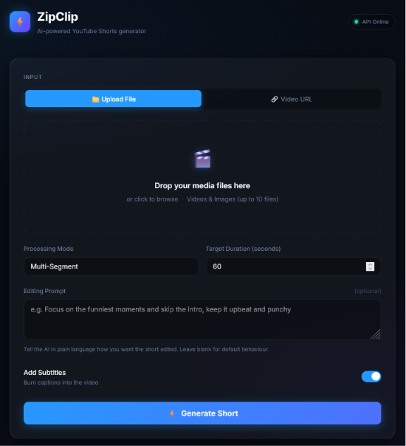
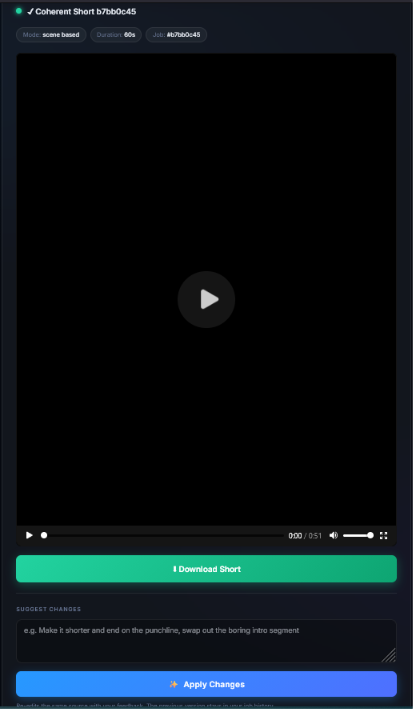

# 🎬 ZipClip

**ZipClip** is an AI-powered video automation platform designed to transform long-form content into engaging, high-impact short-form videos optimized for YouTube Shorts, TikTok, and Instagram Reels. By combining advanced speech recognition,natural language processing, and computer vision, ZipClip automates the tedious parts of video editing..

## ✨ Key Features

*   **Multi-Source Input**: Seamlessly process videos via direct YouTube URLs or local file uploads (MP4, MOV, AVI).
*   **AI Highlight Discovery**: Leverages GPT-4o-mini and Whisper to intelligently identify the most "viral" or meaningful moments in your footage.
*   **Smart Vertical Cropping**: Automatically converts landscape footage into 9:16 vertical format using face detection and motion tracking to keep the subject in frame.
*   **Automated Styled Subtitles**: Generates high-quality, word-level highlighted subtitles with modern styling (Montserrat-ExtraBold) to maximize viewer retention.
*   **Intelligent Scene Detection**: Analyzes visual boundaries to ensure cuts happen at natural transitions rather than mid-sentence.
*   **Dynamic Background Music**: Suggests and applies background music based on the "mood" and theme of the video, featuring smart audio ducking during dialogue.
*   **Real-time Processing**: A clean web interface that provides live updates as the AI transcribes, crops, and renders your short.

## 🚀 Processing Modes

ZipClip offers three distinct ways to create content depending on your source material:

| Mode | Best For | What it does |
| :--- | :--- | :--- |
| **Continuous** | Quick Highlights | Extracts one strong, continuous segment from a specific time window. |
| **Transcript-Based** | Educational Content | Scans the entire transcript to find the best 3-5 segments and stitches them into a cohesive story. |
| **Scene-Based** | Vlogs & Presentations | Analyzes visual scene changes to pick the most visually interesting moments throughout the video. |

## 🛠 How It Works

1.  **Ingest**: Provide a video file or link.
2.  **Analyze**: ZipClip transcribes the audio and detects visual scene boundaries.
3.  **Select**: The AI evaluates the content against "story arc" requirements (Hook, Build-up, Climax, Resolution).
4.  **Edit**: The system automatically crops, stitches, adds subtitles, and overlays music.
5.  **Review**: Preview your generated short directly in the browser and download the final render.
